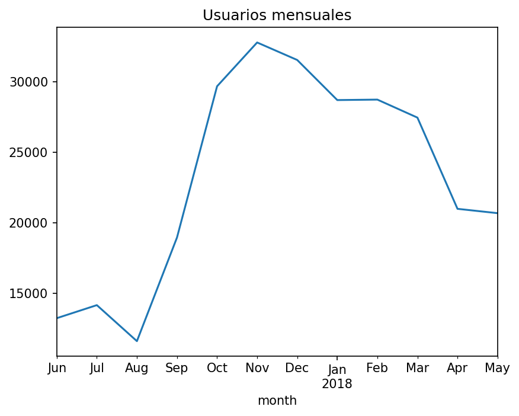
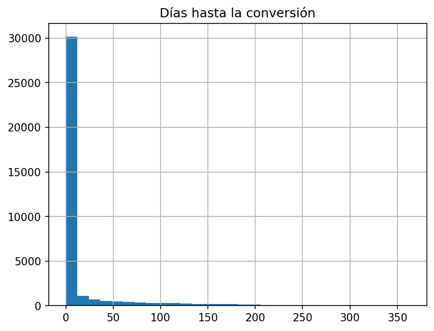
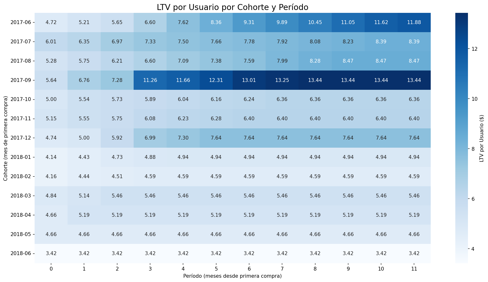

# 📊 Optimización Financiera y de Marketing — Showz


Análisis de comportamiento de usuarios, ciclo de ventas y eficiencia de inversión en marketing para **Showz**, una plataforma de venta de entradas en línea. El objetivo es determinar en qué canales de adquisición invertir y cuáles reducir o pausar, con base en métricas de rentabilidad por cohorte.

## 🎯 Contexto del problema

Showz opera con un **ROMI global negativo**: gasta más en marketing de lo que recupera en ingresos. Sin embargo, el problema no es el producto sino la **asignación del presupuesto**: algunas fuentes son altamente rentables mientras otras destruyen valor, y ambas conviven sin criterio de corte.

Este análisis proporciona la evidencia cuantitativa para tomar decisiones de redistribución de presupuesto con base en tres métricas combinadas: **LTV por cohorte, CAC por fuente y ROMI por fuente**.

## 📁 Estructura del proyecto

```
showz-marketing-analysis/
│
├── data/                        # Datasets (descarga automática al ejecutar)
│   ├── visits_log_us.csv        # Registro de sesiones de usuarios
│   ├── orders_log_us.csv        # Registro de compras
│   └── costs_us.csv             # Gasto en marketing por fuente y fecha
│
├── project_analysis_4_enhanced.ipynb   # Notebook principal con análisis completo
└── README.md
```


## 🧰 Stack tecnológico

| Herramienta | Uso |
|---|---|
| `pandas` | Manipulación y transformación de datos |
| `numpy` | Cálculos numéricos |
| `matplotlib` | Visualizaciones base |
| `seaborn` | Mapas de calor (análisis de cohortes) |

## 📐 Metodología

El análisis sigue cuatro bloques secuenciales, cada uno construyendo sobre el anterior:

### 1. Comportamiento de usuarios
- Cálculo de **DAU / WAU / MAU** para identificar tendencias y estacionalidad
- Análisis de sesiones por día, duración y frecuencia de retorno
- Segmentación de usuarios por perfil de visita (transaccional vs. recurrente)



### 2. Análisis de ventas
- **Tiempo de conversión**: días entre primera visita y primera compra
- **Frecuencia de compra**: distribución de pedidos por usuario (diario, semanal, mensual)
- **Ticket promedio (AOV)**: ingreso por transacción y distribución de precios



### 3. LTV por cohortes
- Agrupación de usuarios por mes de primera compra
- Cálculo de **ingresos acumulados por cohorte y período**
- Normalización por tamaño de cohorte → **LTV por usuario**, la métrica relevante para decisiones de marketing
- Visualización mediante mapas de calor para comparar cohortes



### 4. Eficiencia de marketing por fuente
- **CAC (Customer Acquisition Cost):** gasto / usuarios adquiridos por fuente
- **ROMI (Return on Marketing Investment):** (ingresos − gasto) / gasto × 100
- Cruce de ambas métricas con LTV para determinar la sostenibilidad de cada canal

## 🔍 Principales hallazgos

| Insight | Hallazgo | Acción |
|---|---|---|
| **Negocio transaccional** | 77% de usuarios tiene 1 sola sesión; 80% visitó solo 1 día | Optimizar Landing Page y experiencia de pago |
| **Estacionalidad Q4** | Pico claro en Oct–Dic; caída en febrero | El presupuesto de marketing debe concentrarse en Q4 |
| **ROMI por asignación** | ROMI global negativo, pero fuentes 1, 2, 5 y 7 son rentables | Redistribuir fuentes ineficientes, no reducir el presupuesto total |
| **Orgánico subestimado** | Fuentes 6 y 7 con CAC ≈ $0 y ROMI casi infinito | Invertir en SEO/referidos para escalar estas fuentes |
| **Techo de CAC** | LTV promedio de $7–10; ticket promedio de $5 | CAC máximo tolerable: ~$5 por usuario |


## 📈 Recomendaciones de inversión

```
Prioridad 1 — Maximizar:   Fuentes 1, 2, 5 y 7  →  ROMI positivo confirmado
Prioridad 2 — Optimizar:   Fuente 4             →  Alto volumen, mejorar conversión
Prioridad 3 — Reducir:     Fuentes 3, 9 y 10    →  CAC alto vs. LTV insuficiente
```

**Umbral de corte propuesto:** cualquier fuente con ROMI < 50% durante 2 meses consecutivos debe pausarse o reducirse al 20% de su presupuesto actual.

## ▶️ Cómo ejecutar el proyecto

Este proyecto utiliza los datasets `costs_us.csv` `orders_log_us.csv` `visits_log_us.csv` proporcionados por **TripleTen** para fines de análisis estadístico.

```bash
# 1. Clonar el repositorio
git clone https://github.com/tu-usuario/showz-marketing-analysis.git
cd showz-marketing-analysis

# 2. Instalar dependencias
pip install pandas numpy matplotlib seaborn jupyter requests

# 3. Abrir el notebook
jupyter notebook project_analysis_4_enhanced.ipynb
```

> Los datasets se descargan automáticamente al ejecutar la primera celda del notebook — no es necesario cargarlos manualmente.


## 🔗 Conexión con análisis de riesgo crediticio

Las técnicas aplicadas en este proyecto tienen transferencia directa al ámbito de **riesgo crediticio en fintech**:

- El **análisis de cohortes por LTV** es análogo al análisis de **cosechas (vintages)** usado para monitorear el comportamiento de carteras de crédito a lo largo del tiempo
- El cálculo de **conversión y frecuencia** es equivalente al análisis de **probabilidad de pago y comportamiento de recompra** en scoring
- La **segmentación por fuente de adquisición** refleja la lógica de segmentar solicitantes por canal para ajustar el modelo de riesgo

---
Desarrolado por Inti Alberto Romero González  
Data Analyst · Construyendo expertise en Riesgo Crediticio | Fintech & Remoto  
[](https://linkedin.com/in/inti-romero)